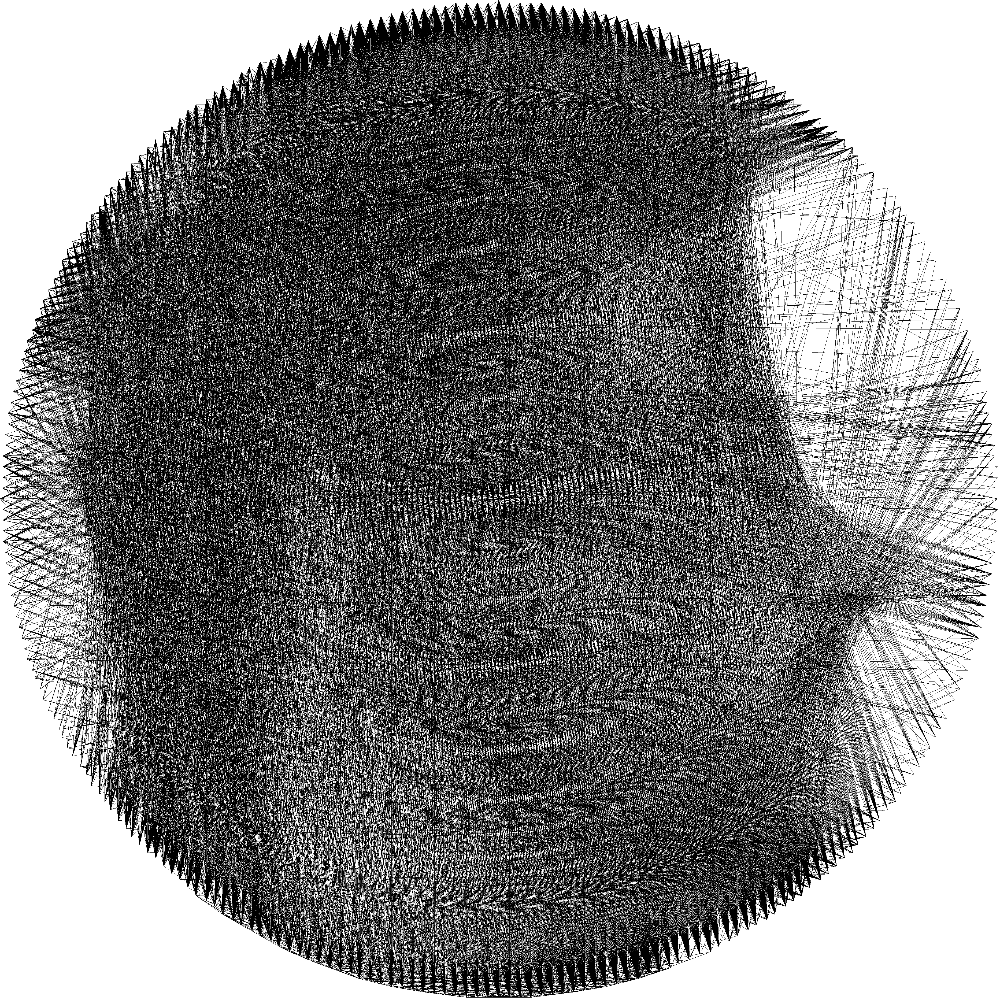

# String Art

From [Wikipedia](https://en.wikipedia.org/wiki/String_art)

> String art, pin and thread art, or filography is characterized by an arrangement of colored thread strung between points to form geometric patterns or representational designs such as a ship's sails, sometimes with other artist material comprising the remainder of the work. 

This repo is an implementation to generate string art from an image

<div align="center">
    
</div>

## Building

You can use this app in two versions:

### CLI 

With the cli version you can generate stringart images and the file for the line sequence within your terminal:

```
Generate string art from a picture

Usage: stringart [OPTIONS] [INPUT]

Arguments:
  [INPUT]  Path to the input image

Options:
  -o, --output <OUTPUT>            Path to save the output image [default: string_art_output.png]
  -c, --coordinates <COORDINATES>  Path to save the coordinates of the lines [default: lines.txt]
  -p, --points <POINTS>            Number of points [default: 288]
  -l, --lines <LINES>              Number of lines [default: 4000]
  -s, --scale <SCALE>              Scale of the image [default: 10.0]
  -w, --weight <WEIGHT>            Weight of each line [default: 20]
  -h, --help                       Print help
  -V, --version                    Print version
```

To build this use

```sh
cargo build --release --bins
```

or install it in your system with. 

```sh 
cargo install --path . --bins
```

### WASM 

There is a library crate that exports the function to generate with stringart in WebAssembly for the use in the web. You can get the compiled WASM and javascript glue with 

```sh 
 wasm-pack build --target web --release
```

This will output the files into the `pkg` directory. For more information about this see [`wasm-bindgen` docs](https://wasm-bindgen.github.io/wasm-bindgen/introduction.html).
