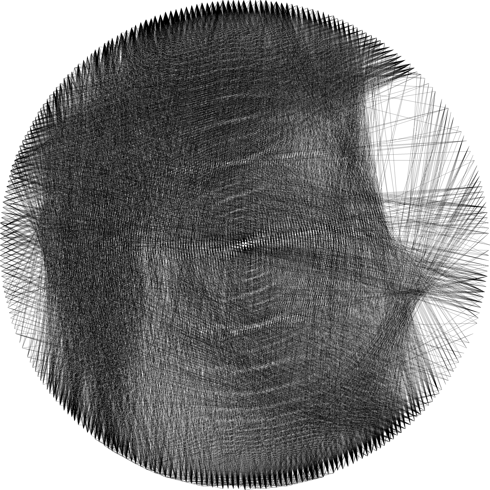

# String Art

From [Wikipedia](https://en.wikipedia.org/wiki/String_art)

> String art, pin and thread art, or filography is characterized by an arrangement of colored thread strung between points to form geometric patterns or representational designs such as a ship's sails, sometimes with other artist material comprising the remainder of the work. 

This repo is an implementation to generate string art from an image

    

